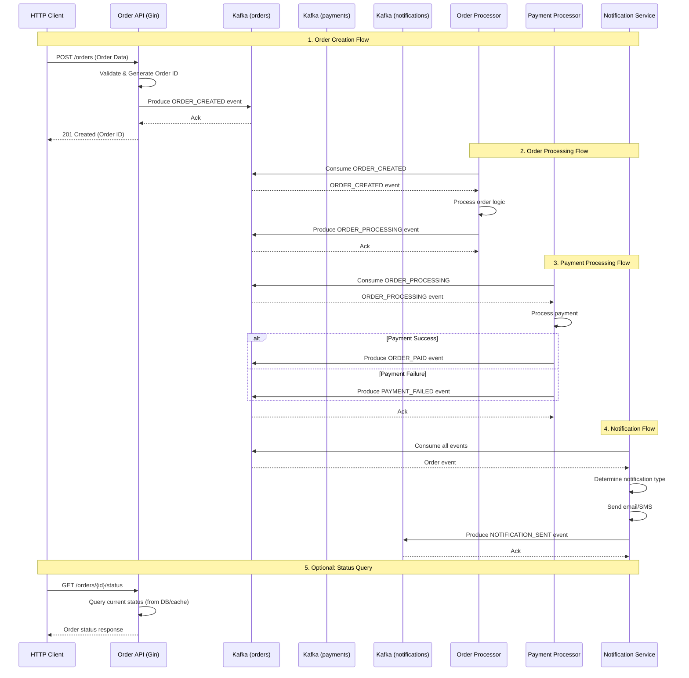

High Level Design (HLD) And Sequence diagram for the Order Processing System with Kafka.

## High-Level Design (HLD) Document

### 1. System Overview

**System Name:** Order Processing System with Kafka  
**Description:** A distributed, event-driven order processing system that handles order creation, payment processing, and notifications through Kafka messaging.

### 2. Architecture Diagram

```
┌─────────────────┐    ┌─────────────────┐    ┌─────────────────┐
│   HTTP API      │    │   Order         │    │   Payment       │
│   (Gin)         │    │   Processor     │    │   Processor     │
│                 │    │                 │    │                 │
│  POST /orders   │    │  Processes      │    │  Handles        │
│  GET /health    │    │  order logic    │    │  payments       │
└────────┬────────┘    └────────┬────────┘    └────────┬────────┘
         │                      │                      │
         │  Kafka Messages      │  Kafka Messages      │  Kafka Messages
         ▼                      ▼                      ▼
┌─────────────────────────────────────────────────────────────────┐
│                       Apache Kafka Cluster                      │
│                                                                 │
│  ┌─────────────┐  ┌─────────────┐  ┌─────────────┐              │
│  │   orders    │  │  payments   │  │notifications│              │
│  │   Topic     │  │   Topic     │  │   Topic     │              │
│  └─────────────┘  └─────────────┘  └─────────────┘              │
└─────────────────────────────────────────────────────────────────┘
         ▲                      ▲                      ▲
         │                      │                      │
         │  Kafka Messages      │  Kafka Messages      │  Kafka Messages
         │                      │                      │
┌────────┴────────┐    ┌────────┴────────┐    ┌────────┴────────┐
│   Notification  │    │   Database      │    │   External      │
│   Service       │    │   (Optional)    │    │   Services      │
│                 │    │                 │    │                 │
│  Sends emails   │    │  Stores orders  │    │  Payment        │
│  & SMS          │    │  & events       │    │  gateways       │
└─────────────────┘    └─────────────────┘    └─────────────────┘
```

### 3. Component Architecture

#### 3.1 Main Components

1. **HTTP API Service (Gin)**
   - RESTful endpoints for order creation
   - Health check endpoints
   - Request validation

2. **Order Processor**
   - Consumes ORDER_CREATED events
   - Processes business logic
   - Updates order status
   - Produces ORDER_PROCESSING events

3. **Payment Processor**
   - Consumes ORDER_PROCESSING events
   - Simulates payment processing
   - Produces ORDER_PAID or PAYMENT_FAILED events

4. **Notification Service**
   - Consumes all order events
   - Sends emails and SMS notifications
   - Handles different event types

5. **Kafka Infrastructure**
   - Topics: orders, payments, notifications
   - Consumer groups for scaling
   - Message retention policies

#### 3.2 Data Flow

```
HTTP Request → Order Service → Kafka → Order Processor → Kafka 
→ Payment Processor → Kafka → Notification Service
```

### 4. Kafka Topics Design

| Topic Name | Partitions | Retention | Description |
|------------|------------|-----------|-------------|
| orders | 3 | 7 days | Main order events stream |
| payments | 3 | 7 days | Payment-related events |
| notifications | 3 | 3 days | Notification events |
| dlq | 1 | 30 days | Dead letter queue |

### 5. Event Schema

```json
{
  "type": "ORDER_CREATED",
  "order": {
    "id": "uuid",
    "user_id": "string",
    "email": "string",
    "items": [],
    "total_amount": 99.99,
    "status": "CREATED",
    "timestamps": {}
  },
  "timestamp": "2023-12-07T10:30:00Z",
  "metadata": {
    "correlation_id": "uuid",
    "source": "service-name",
    "attempt": 1
  }
}
```

### 6. Event Types

| Event Type | Source | Description |
|------------|--------|-------------|
| ORDER_CREATED | HTTP API | New order created |
| ORDER_PROCESSING | Order Processor | Order being processed |
| ORDER_PAID | Payment Processor | Payment successful |
| PAYMENT_FAILED | Payment Processor | Payment failed |
| ORDER_SHIPPED | (Future) | Order shipped |
| ORDER_COMPLETED | (Future) | Order delivered |

### 7. Scaling Strategy

- **Horizontal Scaling**: Multiple instances of each service
- **Consumer Groups**: Each service uses consumer groups for load balancing
- **Partitioning**: Events partitioned by order_id for ordering guarantees
- **Monitoring**: Prometheus metrics, health checks

### 8. Failure Handling

- **Retry Mechanism**: Exponential backoff for failed messages
- **Dead Letter Queue**: Failed messages moved to DLQ
- **Circuit Breaker**: Prevent cascading failures
- **Idempotency**: Message processing is idempotent

### 9. Monitoring & Observability

- **Metrics**: Request rates, error rates, processing latency
- **Logging**: Structured logging with correlation IDs
- **Tracing**: Distributed tracing across services
- **Health Checks**: Regular service health monitoring

## Sequence Diagram



## Detailed Sequence Description

### 1. Order Creation
- Client sends HTTP POST request with order data
- API validates, generates UUID, calculates total
- API produces ORDER_CREATED event to Kafka
- Client receives immediate response with order ID

### 2. Order Processing
- Order Processor consumes ORDER_CREATED events
- Processes business logic (inventory check, validation)
- Updates order status to PROCESSING
- Produces ORDER_PROCESSING event

### 3. Payment Processing
- Payment Processor consumes ORDER_PROCESSING events
- Simulates payment gateway interaction
- Based on success/failure, produces appropriate event
- Handles retries for transient failures

### 4. Notification Handling
- Notification Service consumes all order events
- Determines appropriate notification type
- Sends emails/SMS based on event type
- Produces notification audit events

### 5. Status Query (Optional)
- Client can query order status via HTTP API
- API would need to persist order state (not shown in current implementation)

## Key Design Decisions

1. **Event-Driven Architecture**: Loose coupling between services
2. **Immediate Response**: HTTP API responds immediately, processing happens async
3. **Idempotent Processing**: Services can handle duplicate messages safely
4. **Scalability**: Each service can scale independently
5. **Fault Tolerance**: Failed messages can be retried or moved to DLQ
6. **Observability**: Comprehensive logging and metrics

## Future Enhancements

1. **Persistence Layer**: Add database for order state persistence
2. **Caching**: Redis for frequently accessed data
3. **Saga Pattern**: For distributed transaction management
4. **Schema Registry**: For event schema evolution
5. **Rate Limiting**: Protect services from overload
6. **Advanced Monitoring**: APM integration, custom dashboards

This design provides a robust foundation for a real-world order processing system that can scale and handle failures gracefully while maintaining loose coupling between services.